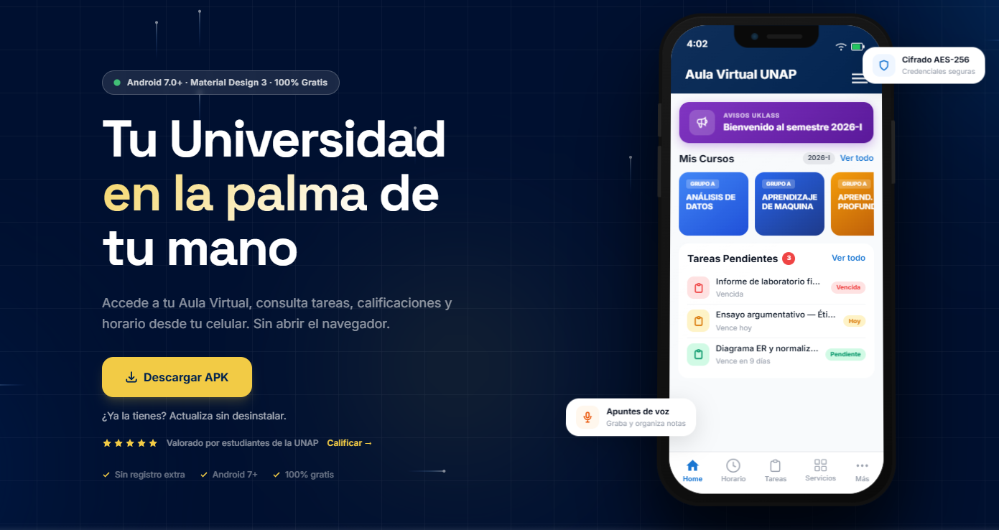
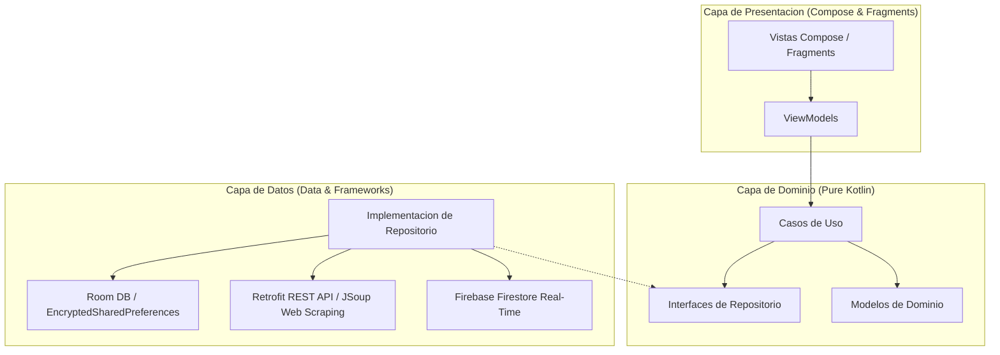

# Uklass - Super App Universitaria



El proyecto Uklass es una solución móvil de grado de producción diseñada para unificar, centralizar y optimizar los servicios digitales fragmentados de una institución académica. El sistema combina una aplicación nativa de Android de alto rendimiento con un panel de administración web, resolviendo la fragmentación de la infraestructura informática a través de agregación de datos en cliente (Client-Side Aggregation), persistencia local reactiva y sincronización asíncrona en la nube.

Sitio Web Oficial: [https://uklass.vercel.app/](https://uklass.vercel.app/)

## Características Clave del Ecosistema

- **Unificación de Portales Fragmentados**: Centraliza el Aula Virtual, la Intranet de Notas y el portal de Matrícula en una única interfaz unificada, eliminando los flujos de inicio de sesión repetitivos.
- **Motor de Ingesta Dinámica**: Implementa técnicas de agregación mediante consumo de APIs REST y parsing semántico en cliente (web scraping con JSoup) para estructurar datos no procesados provenientes de portales institucionales heredados.
- **Sistema de Anuncios y Avisos en Tiempo Real**: Un canal dinámico de comunicados segmentados por carrera y facultad, administrado desde una consola web externa y sincronizado al instante en los dispositivos de los estudiantes.
- **Estrategia de Sincronización Offline-First**: Acceso instantáneo sin conexión a internet a horarios, notas históricas, calendarios y actividades académicas mediante la persistencia automatizada de datos en base de datos local.
- **Seguridad y Cierre Biométrico**: Almacenamiento seguro de credenciales con cifrado por hardware y una interfaz de bloqueo nativa mediante reconocimiento facial o dactilar.

---

## Arquitectura y Diseño de Software

El aplicativo Android está estructurado bajo los principios de Clean Architecture y el patrón arquitectónico Model-View-ViewModel (MVVM). Se adopta una modularización híbrida basada en paquetes y características (Package-by-Feature / Package-by-Layer) que promueve un desacoplamiento estricto, facilita la mantenibilidad y optimiza las pruebas unitarias.



### Capa de Dominio (Domain)
El núcleo del negocio está escrito en Kotlin puro y permanece completamente aislado de librerías del SDK de Android o frameworks de terceros. Contiene:
- **Entidades de Negocio**: Modelos de datos inmutables y autocontenidos (`Nota`, `Tarea`, `Curso`, `AnuncioRemoto`).
- **Interfaces de Repositorio**: Definen el contrato de acceso a datos que los ViewModels consumen, abstrayendo la procedencia de la información (red, base de datos local o nube).

### Capa de Datos (Data)
Coordina la procedencia y almacenamiento de la información implementando los contratos del dominio:
- **Persistencia Local (Room)**: Administrada por una base de datos SQLite local mediante consultas indexadas y un control riguroso de migraciones SQL. Persiste de forma local asignaturas, horarios estructurados, notas de apuntes y progreso de gamificación del estudiante.
- **Servicios de Red (Retrofit & JSoup)**: Clientes HTTP modulares con inyección dinámica de cookies de sesión para la navegación y extracción asíncrona de recursos de servidores web académicos.
- **Seguridad Criptográfica**: Implementa SharedPreferences encriptadas con algoritmo AES-256 (`androidx.security:security-crypto`) para resguardar las credenciales de los estudiantes y las cookies de sesión dinámicas.

### Capa de Presentación (Presentation)
Maneja la lógica de visualización y control mediante una arquitectura reactiva:
- **UI Declarativa**: Diseñada en Jetpack Compose con componentes Material Design 3, animaciones avanzadas y un flujo unidireccional de datos gobernado por StateFlow.
- **Navegación Híbrida**: Coordina actividades y fragmentos tradicionales con transiciones de empuje lateral de alto rendimiento en la actividad raíz (`MainActivity`), sincronizadas con el comportamiento del sistema operativo.

---

## Integración Avanzada con Firebase

Uklass hace uso de las capacidades en la nube de Firebase para potenciar la comunicación en tiempo real, el análisis de negocio y la estabilidad del producto:

### 1. Mensajería y Anuncios Reactivos (Firestore)
El módulo de anuncios implementa un flujo reactivo asíncrono para mantener a los estudiantes informados de manera instantánea:
- **CallbackFlow y Coroutines**: Convierte los SnapshotListeners tradicionales de Firestore en flujos fríos (`Flow<Result<List<AnuncioRemoto>>>`) para una recolección estructurada dentro de la arquitectura reactiva de la aplicación.
- **Segmentación Inteligente (Query Merging)**: Realiza consultas concurrentes para combinar anuncios públicos generales con anuncios en fase experimental. El repositorio filtra y ordena la información localmente en función del correo del usuario, carrera, sede y vigencia temporal.
- **Segmentación de Testers**: Permite la distribución de avisos controlados (`modoTest`) a un grupo delimitado de correos registrados en Firestore, facilitando pruebas piloto en producción sin afectar a la base general.

### 2. Estabilidad y Analíticas
- **Firebase Analytics**: Registra métricas de navegación internas, permitiendo identificar las secciones con mayor interacción (Horarios, Notas, Apuntes) bajo parámetros de privacidad de datos.
- **Firebase Crashlytics**: Monitorea de manera proactiva los fallos en dispositivos de producción, capturando excepciones de red o errores de parseo HTML para agilizar el debugging.

---

## Consola de Administración (Admin Panel)

Uklass incluye un panel de control administrativo web independiente (`admin-panel/`) desarrollado en HTML5, CSS y JavaScript Vanilla (utilizando TailwindCSS para el diseño responsivo). 

Esta consola permite a los coordinadores autorizados:
- **Publicar Comunicados en Tiempo Real**: Crear, editar y desactivar anuncios almacenados en Firebase Firestore.
- **Personalización de Avisos**: Configurar niveles de prioridad, estilos gráficos (normal, alerta, crítico), imágenes de portada, descripciones enriquecidas y enlaces de redirección (WhatsApp, Deep Links nativos, sitios web).
- **Segmentación del Público Objetivo**: Definir qué universidad o carrera en específico recibirá el anuncio mediante un sistema dinámico de segmentación por metadatos.
- **Gestión de Entorno de Pruebas**: Añadir y remover correos de testers autorizados para la validación previa de publicaciones en dispositivos piloto.

---

## Estructura del Proyecto

El repositorio está organizado dividiendo la aplicación móvil del panel de administración web:

```text
Uklass/
├── admin-panel/                       # Consola web de administracion de anuncios
│   ├── index.html                     # Interfaz responsiva del panel de control
│   ├── app.js                         # Logica de autenticacion y operaciones CRUD con Firestore
│   └── styles.css                     # Estilos visuales complementarios
│
├── repositorio-github/                # Carpeta especial para la publicacion de portafolio
│   ├── assets/
│   │   ├── banner.png                 # Imagen de banner promocional del repositorio
│   │   └── screenshots/               # Capturas de pantalla e imagenes de evidencia visual
│   ├── docs/                          # Documentacion complementaria y reportes
│   └── README.md                      # Este archivo de documentacion tecnica
│
└── app/                               # Codigo fuente de la aplicacion Android (Estructura interna)
    ├── src/
    │   ├── main/
    │   │   ├── java/com/lex/virtualapp/
    │   │   │   ├── core/              # Componentes compartidos e inyeccion (Hilt)
    │   │   │   ├── data/              # Implementaciones de repositorios, Room y Retrofit
    │   │   │   ├── domain/            # Modelos de negocio e interfaces de repositorio
    │   │   │   ├── presentation/      # Pantallas Jetpack Compose y ViewModels
    │   │   │   │
    │   │   │   # MÓDULOS DE MICRO-FEATURES INDEPENDIENTES
    │   │   │   ├── apuntes/           # Notas de estudio asociadas a clases y cursos
    │   │   │   ├── racha/             # Logica de gamificacion y retencion del usuario
    │   │   │   └── avisos/            # Canal de comunicados reactivo con Firestore
    │   │   │
    │   │   └── App.kt                 # Application class y setup global de cookies
    │   └── build.gradle.kts
    └── schemas/                       # Esquemas JSON para el control de versiones de Room
```

---

## Stack Tecnológico Detallado

### Aplicación Android
- **Lenguaje Principal**: Kotlin (v2.2.10) compilado bajo JDK 11.
- **UI & Framework**: Jetpack Compose (BOM 2025.01.01) + Material Design 3.
- **Navegación**: Navigation Compose (v2.8.6) + Hilt Navigation Integration.
- **Persistencia**: Room Database (v2.8.4) con compilador KSP.
- **Conectividad REST**: Retrofit (v2.11.0) y OkHttp (v4.12.0) con interceptación avanzada.
- **Parseo de Contenido**: JSoup (v1.18.3) para web scraping asíncrono.
- **Inyección de Dependencias**: Dagger Hilt (v2.59.1) con soporte Hilt WorkManager.
- **Tareas Programadas**: WorkManager (v2.10.0) para sincronización en segundo plano.
- **Almacenamiento Seguro**: AndroidX Security-Crypto (v1.0.0) y AndroidX Biometric (v1.1.0).
- **Asistentes de Visualización**: Coil-Compose (v2.5.0) para imágenes y RichEditor-Compose (v1.0.0-rc13).
- **Control de Logs**: Timber (v5.0.1) y ThreeTenABP (v1.4.4) para manejo de fechas.

### Panel Administrativo Web
- **Lenguaje**: JavaScript Vanilla (ES6+).
- **Estilos**: TailwindCSS.
- **Persistencia y Nube**: Firebase SDK (Auth y Firestore Real-Time).

---

## Nota de Acceso e Integridad del Repositorio

> [!IMPORTANT]
> El código fuente del motor de negocio principal, las claves API y las credenciales han sido omitidas de este repositorio público con el fin de resguardar la seguridad y privacidad del alumnado, al depender directamente de endpoints y servidores internos no públicos de la institución académica.
>
> Este repositorio se expone exclusivamente como evidencia arquitectónica, estructuración de componentes y buenas prácticas de ingeniería de software móvil para portafolio profesional.

### Evidencias de Ejecución (Visual Showroom)
Para comprobar el funcionamiento interactivo de la aplicación (flujo biométrico, sincronización de avisos, calendario del estudiante, editor de apuntes y listado de cursos), por favor diríjase al directorio de capturas:

[Ver Carpeta de Capturas de Pantalla (Screenshots)](./assets/screenshots/)
